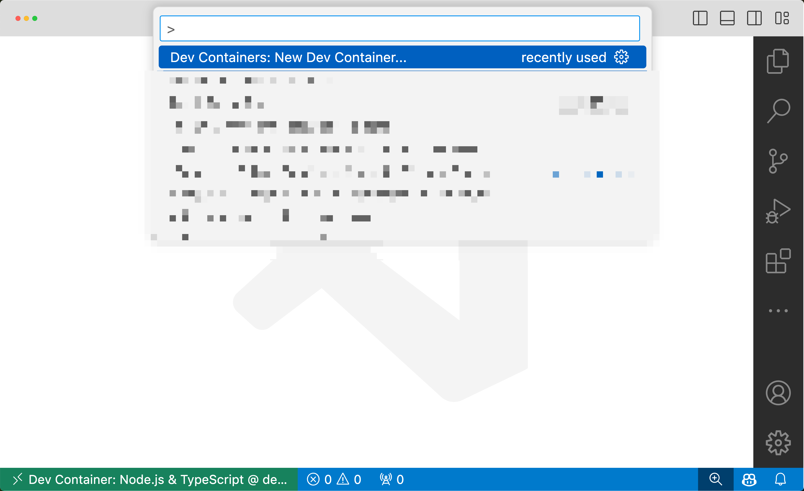

## Demo 1: Dockerfile Vs Multi-Stage Build

## Building the Image

```
docker build -t getting-started-v1 . -f Dockerfile.base
```

## Result:

```
docker images
REPOSITORY                                   TAG         IMAGE ID       CREATED          SIZE
getting-started-v1                           latest      f68fce1f3fbf   5 seconds ago    1.24GB
```

## Building the Image with Multi-Stage Build

```
 docker build -t getting-started-v1_1 . -f Dockerfile1.multi
```

## Result:

```
docker images
REPOSITORY                                   TAG         IMAGE ID       CREATED          SIZE
getting-started-v1_1                         latest      c3cf2766c545   4 seconds ago    1.12GB
```

## Building the Image with Multi-Stage Build with Slimmer Version

```
 docker build -t getting-started-v1_2 . -f Dockerfile2.multi
```

```
docker images
REPOSITORY
getting-started-v1_2                         latest      5ddbab822611   16 seconds ago   288MB
```

## Demo 2: Multi-Container app - Using MySQL

```
 docker compose up -d
```

```
 sh-4.4# mysql -uroot -p
Enter password: 
Welcome to the MySQL monitor.  Commands end with ; or \g.
Your MySQL connection id is 10
Server version: 8.0.35 MySQL Community Server - GPL

Copyright (c) 2000, 2023, Oracle and/or its affiliates.

Oracle is a registered trademark of Oracle Corporation and/or its
affiliates. Other names may be trademarks of their respective
owners.

Type 'help;' or '\h' for help. Type '\c' to clear the current input statement.

mysql> show tables;
ERROR 1046 (3D000): No database selected
mysql> show databases;
+--------------------+
| Database           |
+--------------------+
| information_schema |
| mysql              |
| performance_schema |
| sys                |
| todos              |
+--------------------+
5 rows in set (0.01 sec)

mysql> show tables from todos;
+-----------------+
| Tables_in_todos |
+-----------------+
| todo_items      |
+-----------------+
1 row in set (0.00 sec)

mysql>  select * from todo_items;
ERROR 1046 (3D000): No database selected
mysql> use todos
Reading table information for completion of table and column names
You can turn off this feature to get a quicker startup with -A

Database changed
mysql> use todos;
Database changed
mysql>  select * from todo_items;
+--------------------------------------+---------------+-----------+
| id                                   | name          | completed |
+--------------------------------------+---------------+-----------+
| c7a13f20-b096-4fb7-a499-0b8c17c12808 | Watch Netflix |         0 |
+--------------------------------------+---------------+-----------+
1 row in set (0.00 sec)

mysql>
```

## Demo 3: Using Healthcheck

```
 docker build -t getting_started_v1_3 . -f Dockerfile.healthcheck
```

```
docker ps
CONTAINER ID   IMAGE                  COMMAND                  CREATED          STATUS                             PORTS                    NAMES
2151c8a3ae01   getting-started-v1_3   "docker-entrypoint.s…"   31 seconds ago   Up 31 seconds (health: starting)   0.0.0.0:3000->3000/tcp   sad_hodgkin
```

## Demo 4 - Demonstrating Compose Include

```
docker compose down
docker compose -f web.yml up
```

## Demo 5 - DevContainers


